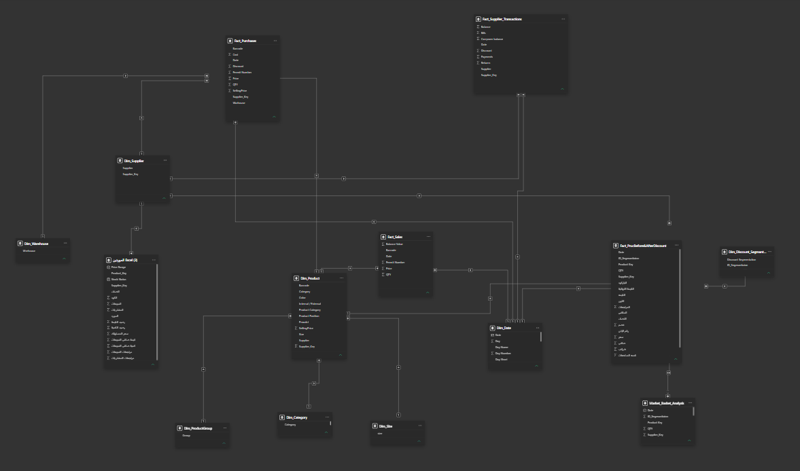

# 📊 COTTONIL - Retail Analytics Power BI Dashboard

## 📌 Project Executive Summary
A comprehensive, end-to-end Business Intelligence solution engineered for **Cottonil** (leading Egyptian textile and retail brand). The objective of this project is to convert raw operational data into actionable strategic insights across sales, revenue growth, stock levels, discount efficiency, supplier reliability, and product sizing distributions.

---

## 🔗 Live Discussion & LinkedIn Post
Check out the interactive project overview, business presentation, and community feedback on **LinkedIn**:
👉 [View Cottonil Retail Analytics Post on LinkedIn](https://lnkd.in/p/e84ppnX4)

---

## 🗺️ Detailed Dashboard Pages & Analytical Breakdown

### 1. Cover Page
> **Overview & Design Concept:**
> The main landing page establishes the brand identity and sets an executive tone for the report. It is built with an intuitive navigation interface allowing stakeholders to quickly transition between core operational areas including Sales, Inventory, Discounts, and Supplier metrics.


---

### 2. Business Overview Page
> **Key Metrics & High-Level Performance:**
> Serves as the executive summary tracking top-line KPIs along with Year-Over-Year (YoY) growth badges. It reflects **3.27M Gross Sales** (+65.17% YoY), **19.16K Units Sold** (+62.82% YoY), and **4,231 Invoices** (+57.40% YoY).
> 
> **Analytical & Visual Breakdown:**
> - **Seasonal Performance:** Evaluates quarterly seasonality where Q2 (Spring/Summer) leads revenue at **1.28M**, followed by Q1 (Winter/Spring) at **831.52K**.
> - **Category Share:** Highlights product revenue distribution—Men's category dominating **67.98% (2.22M)**, followed by Women's **17.94% (586.77K)**, Kids **9.77%**, and General **4.31%**.
> - **Product Performance & Daily Trends:** Uses combo charts comparing Gross vs. Net Sales against quantity sold, complemented by dynamic line graphs showing daily sales peaks.


---

### 3. Sales Overview & Analytics

#### 🟢 Sales Overview
> **Core Focus:**
> Focuses on total sales velocity, revenue breakdowns across product families, and gross vs. net revenue analysis to identify top revenue drivers.


#### 🟢 Market Basket Analysis (Cross-Selling & Basket Insights)
> **Core Focus & DAX Implementation:**
> Utilizes advanced DAX cross-filtering algorithms to analyze co-purchasing behavior ("Frequently Bought Together"). It identifies which products are most frequently bundled in the same invoice, enabling better cross-selling and promotional bundling.


#### 🟢 Top Invoice Sales
> **Core Focus:**
> Evaluates transaction-level performance, highlighting high-value orders, average basket size, and invoice value distribution to pinpoint key wholesale or bulk-buying customers.


#### 🟢 Sales Analytics
> **Core Focus:**
> Granular analysis examining sales performance across regions, time scales, and product SKUs to uncover hidden sales trends and underperforming channels.


#### 🟢 Unsold Products Analysis
> **Core Focus:**
> Identifies dead stock and low-velocity inventory items that haven't generated sales over designated periods, protecting working capital by recommending targeted liquidations.


---

### 4. Inventory & Returns

#### 🟢 Inventory Performance
> **Core Focus:**
> Tracks stock health, inventory turnover rates, stockout risks, and warehouse holding levels to ensure seamless supply chain alignment with retail demand.


#### 🟢 Returns & Defect Analytics
> **Core Focus:**
> Monitors return rates, total returned quantities, and associated financial losses. It helps detect quality issues or sizing mismatches in specific product categories early.


---

### 5. Discounts & Scenario Analysis

#### 🟢 Discount Overview
> **Core Focus:**
> Analyzes total markdown costs (**34.70K Total Discount**, +79.46% YoY) and measures discount effectiveness on volume push versus margin dilution.


#### 🟢 Discount Breakdown (Discount 2)
> **Core Focus:**
> Deeper dive into promotional campaign performance, evaluating how different discount tiers impact net profitability per category.


#### 🟢 Interactive What-If Discount Scenarios
> **Core Focus & Power BI Features:**
> Built using dynamic **Power BI What-If Parameters**. Allows business users and financial planners to interactively adjust discount percentages on the fly to simulate future profit margins, gross margins, and volume elasticities before running actual promotions.


---

### 6. Payables, Purchases, Sizes & Suppliers

#### 🟢 Payables Analytics
> **Core Focus:**
> Financial tracking of outstanding vendor liabilities, payment schedules, and cash outflow management.


#### 🟢 Purchases Overview
> **Core Focus:**
> Tracks overall procurement volume (**3.99M Total Purchases**, +78.13% YoY), purchase order efficiency, and unit cost variations.


#### 🟢 Size Distribution Analysis
> **Core Focus:**
> Analyzes sales and stock demand based on garment sizes (e.g., S, M, L, XL, XXL) to prevent size stockouts and optimize manufacturing/procurement orders.


#### 🟢 Supplier Performance Evaluation
> **Core Focus:**
> Evaluates vendor reliability, lead times, order fulfillment accuracy, and total spend per supplier.


---

## 🛠️ Data Architecture & Modeling

> **Star Schema Implementation:**
> Built on an optimized **Star Schema** data model connecting central Fact tables (*Sales, Purchases, Inventory*) with normalized Dimension tables (*Date, Products, Categories, Suppliers, Stores*). This architecture ensures fast DAX query performance and seamless interactivity across all visual pages.


### 💡 Advanced Technical Highlights & DAX
1. **Dynamic Time Intelligence:** Custom DAX measures for YoY growth, YTD performance, and dynamic period-over-period comparisons.
2. **Basket Analysis Logic:** DAX calculations operating over disconnected tables to determine co-occurrence matrix values without performance lag.
3. **What-If Simulations:** Dynamic parameters driving real-time margin estimations.

```dax
// Example DAX Metric: YoY Sales Growth %
Sales YoY Growth % = 
VAR CurrentSales = [Total Sales]
VAR PreviousSales = CALCULATE([Total Sales], SAMEPERIODLASTYEAR('Calendar'[Date]))
RETURN
DIVIDE(CurrentSales - PreviousSales, PreviousSales, 0)
